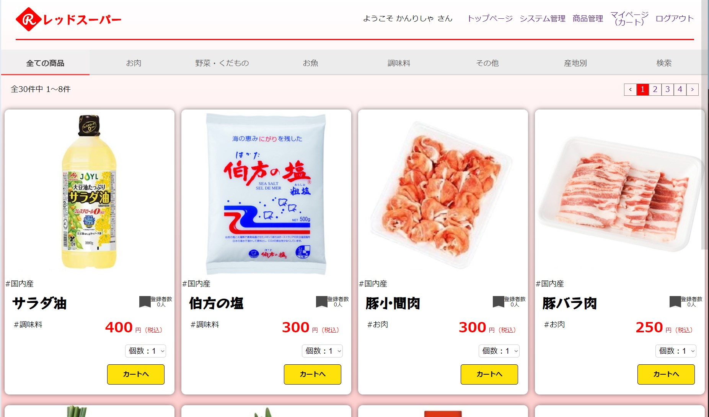
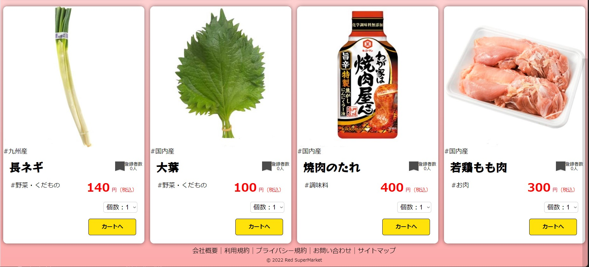
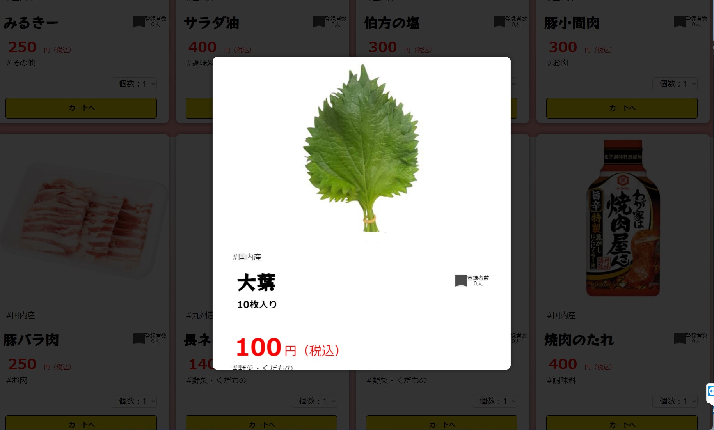
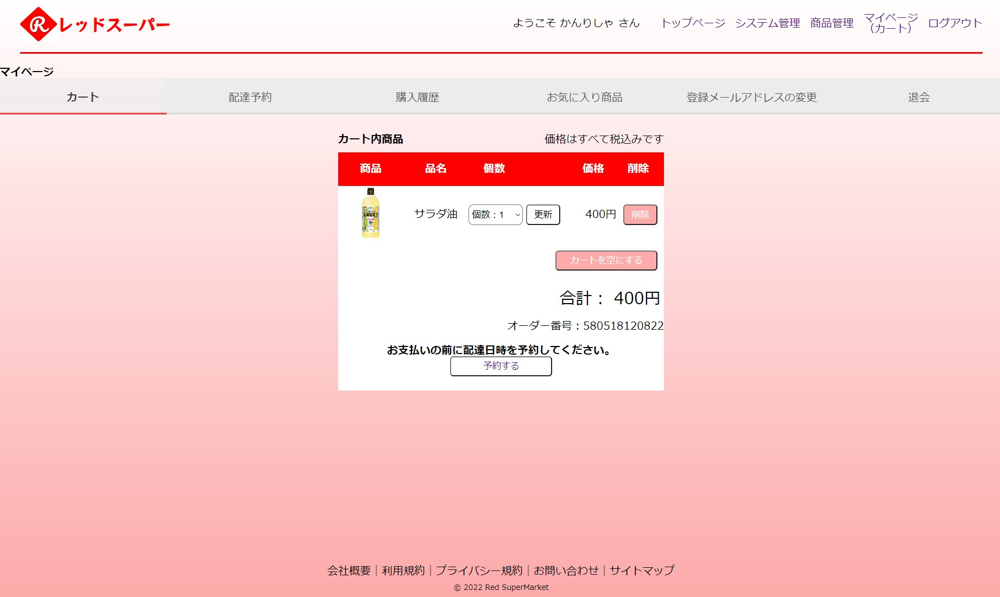
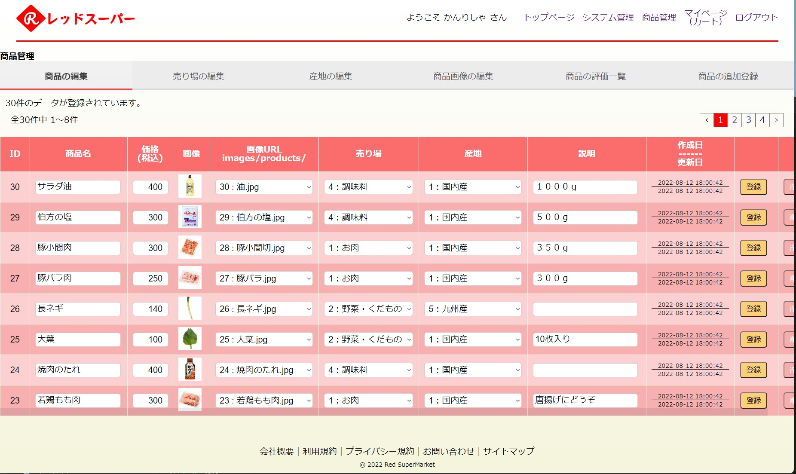
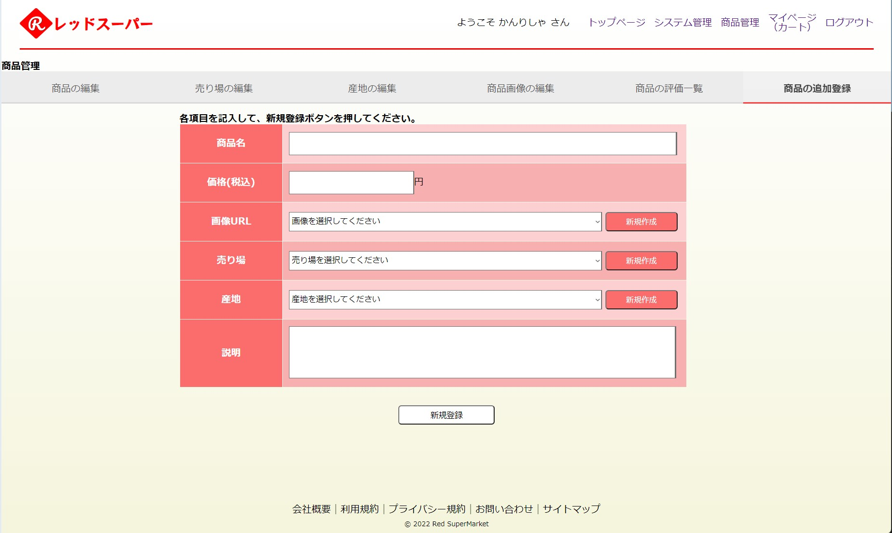
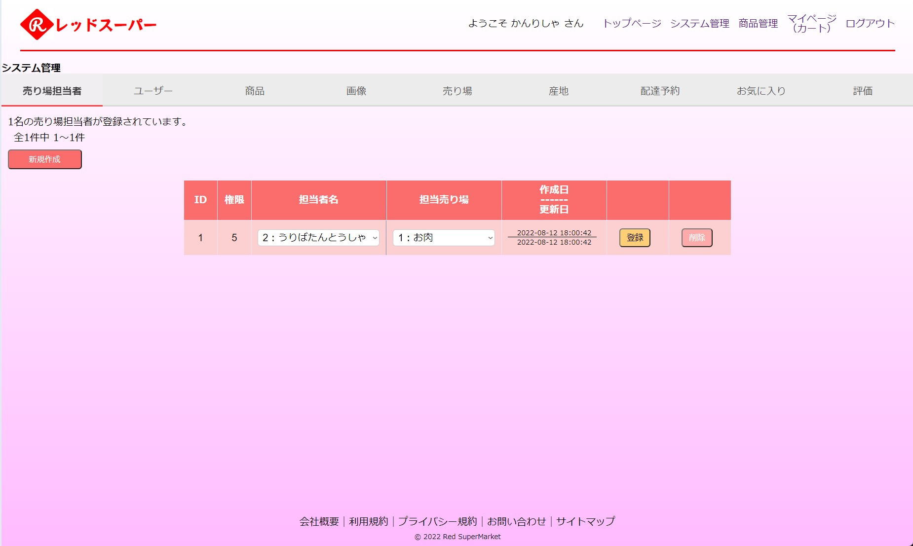
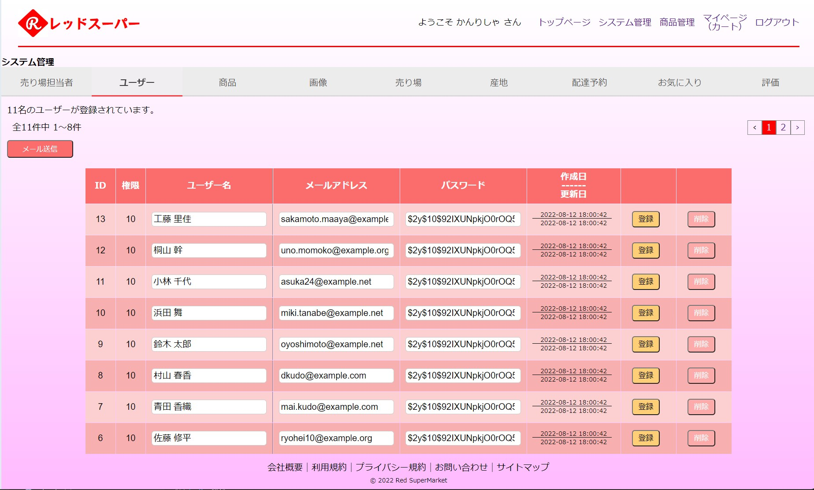

アプリの名称：レッドスーパー
====

## リポジトリ
---
https://github.com/i-system-yaa999/online_supermarket.git

## アプリの概要：オンラインでのスーパーマーケット事業
---

各ページは、レスポンシブデザインを採用し、768px以下のスマホにも対応しています。

## 機能一覧
---
### 未登録ユーザー、登録ユーザー
* 商品の一覧表示
* 売り場ごとの商品検索
* 産地ごとの商品検索
* 商品名称による商品検索
* 商品ごとのお気に入り登録者数確認
* 商品ごとの詳細内容表示
* 商品ごとの評価コメント閲覧
* 未登録の場合はユーザー登録機能

### 登録ユーザー、ログイン後
* メール認証機能
* ショッピングカート機能
* クレジットカード決済機能
* 購入確認email送信機能
* 各注文に対しての配達予約
* 配達日当日の配達お知らせemail送信機能
* 購入履歴確認機能（前回購入分）
* お気に入り登録機能
* お気に入り商品一覧表示
* 商品詳細画面での、購入済みのものに対する、評価、コメント機能
* 購入者に対して、店舗引き換え時用のQRの表示機能
* ユーザー登録後のログイン、ログアウト機能
* 登録メールアドレス変更機能

### 売り場担当者
* 専用管理画面表示機能
* 商品の新規登録、編集、削除機能
* 産地の新規登録、編集、削除機能
* 売り場の新規登録、編集、削除機能
* 商品画像のアップロード、登録機能
* 商品評価一覧表示

### システム管理者
* 専用管理画面表示機能
* 売り場担当者　一覧表示、新規作成、削除、変更
* ユーザー　一覧表示、新規作成、削除、変更
* 商品　一覧表示、新規作成、削除、変更
* 産地名称　一覧表示、新規作成、削除、変更
* 売り場名称　一覧表示、新規作成、削除、変更
* 画像　一覧表示、新規作成、削除、変更、アップロード
* 配達予約　一覧表示
* お気に入り　一覧表示
* 評価　一覧表示
* 管理画面によるユーザーへのお知らせemail送信機能

## デモ画面
---
* 商品の一覧表示

* 商品詳細表示

* カート内表示

* 売り場担当者 商品管理画面

* 売り場担当者 商品の新規追加画面

* システム管理者 売り場担当者編集画面

* システム管理者 ユーザー編集画面

## 要件、環境など
---
* データベースはmysqlを使用しています。
* Windows & Opera にて動作確認しています。

## インストール
---

1. 初めにプロジェクトファイルをダウンロードします。   
コマンドプロンプト： git clone -b develop https://github.com/i-system-yaa999/online_supermarket.git 

2. ライブラリをインストールします。  
コマンドプロンプト：composer install

3. .env.exampleファイルをコピーして.envに改名します。

4. mysqlにてデータベースonline_supermarketを作成します。  
コマンドプロンプト： mysql -u root -p  
mysqlコマンド：create database online_supermarket;

5. マイグレーションをしてテーブルを作成します。  
コマンドプロンプト：cd online_supermarket  
コマンドプロンプト：php artisan migrate

6. シーディングにてダミーデータを作成します。  
コマンドプロンプト：php artisan db:seed  

7. 作成されるダミーデータは、以下になります。  
-1. 商品データ：３０件  
-2. 産地データ：６件  
-3. 売り場データ：５件  
-4. ユーザーデータ：１件（メール：user@system.com パスワード：1234567890 ）  
-5. このユーザーに紐づいた、お気に入り：１件、評価：１件  
-6. ダミーユーザーデータ：１０件（テーブル内データはランダム文字にて作成）  
-7. 店舗代表者：１名(メール：manager@system.com パスワード：1234567890 )  
-8. システム管理者：１名(メール：admin@system.com パスワード：1234567890 )  

8. 画像用のシンボリックリンクを作成するために一度、「public/images/products」フォルダを削除します。削除の方法はOSにより異なります。

9. シンボリックリンクを作成します。
コマンドプロンプト：php artisan storage:link

10. サーバーを起動します。
コマンドプロンプト：php artisan serve

## 使用方法
---
### ユーザー登録、ログイン
* まず初めに、右上にある「新規登録」メニューよりユーザー登録を行ってください。
* 認証用のメールが届きますので、メール内のリンクにて認証してください。
* メール認証後は、右上のメニューより「ログイン」を選択してメールアドレス、パスワードにてログインできます。

### 商品の購入
* 認証、ログイン後に展開されるページにて、商品の一覧が表示されるので、目的の商品を探します。
* タブを切り替えることにより、売り場ごと、または産地ごと、名称で検索での表示も可能です。
* 商品画像をクリックすることにより、商品の説明、評価などの詳細情報が確認できます。
* お気に入りマークをクリックすることにより、お気に入りへの登録も可能です。
* 商品の個数を選択し、「カートへ」ボタンを押して商品をカートに追加します。
* 配達予約をすると「支払い」ボタンが表示されて決済が行えます。
* クレジットカード決済には、テスト用カード番号「4242-4242-4242-4242」をお使いください。その他の項目は任意で結構です。
* 決済後に登録してあるメールアドレスに購入確認メールが届きます。（決済時に入力したメールアドレスでは無く、登録時に入力したアドレスに届きます）
* 補足：メニューの「マイページ」より、購入履歴の確認、お気に入りの管理が行えます。

### 売り場担当者
* 売り場担当者としてログインすると、右上のメニューに「商品管理」へのリンクが表示されますので、そのリンクから商品管理画面に遷移します。
* 商品管理画面では、商品の新規登録、編集、売り場の編集、産地の編集などが行えます。
* 編集が終わったら「登録」ボタンを押して、データベースに登録します。
* 各データを削除したい場合は「削除」ボタンを押すと削除できます。
削除後にデータを元に戻す事はできないので注意してください。
* 商品の管理画面から、商品ごとに、評価の一覧を確認することができます。
* 売り場担当者の売り場ごとの管轄には対応しておりません。

### システム管理者
* システム管理者としてログインすると、右上のメニューに「システム管理」へのリンクが表示されますので、そのリンクからシステム管理画面に遷移します。
* 管理画面は９つのタブに分かれており、各タブごとに次の内容が行えます。

1. 売り場担当者の編集
2. ユーザーの編集
3. 商品の編集
4. 商品画像の編集
5. 売り場名称の編集
6. 産地名称の編集
7. 配達予約の一覧表示
8. お気に入りの一覧表示
9. 評価コメントの一覧表示

* 各タブ共通で、「新規作成」で新たなデータを作成します。
* 登録してあるデータを変更する場合は、一覧表示されたデータを直接編集します。
* データ変更後に「変更」ボタンを押すと、データベースに反映されます。
* データを削除したい場合は「削除」ボタンを押すと削除できます。
削除後にデータを元に戻す事はできないので注意してください。

### メール通知機能
* 本アプリの動作はローカル環境なので、次のコマンドでスケジューラーを有効にすることにより、メールでの通知を行います。
コマンドライン：php artisan schedule:work
* メールでの通知内容は、配達予約の当日になると配達予約の確認メールが登録メールアドレスに届きます。

## 注意事項
---
* 商品の決済とメール送信処理に時間がかかりますので、「支払い」ボタンを押した後はそのままお待ちください。２度押ししないようにしてください。
* 本アプリにて使用しているgmailアドレスなどは他での使用は行わないでください。
* 管理画面にて売り場名称を増減すると、通常ユーザー向けの商品ページのタブも連動して増減します。数が増えた場合は、スクロールにて確認できます。

## Author(著者)
---
* 著者：石橋孝哉
* 所属：i-system
* e-mail：
* [i-system](https://github.com/i-system-yaa999)

## Licence
---
[MIT license](https://en.wikipedia.org/wiki/MIT_License).